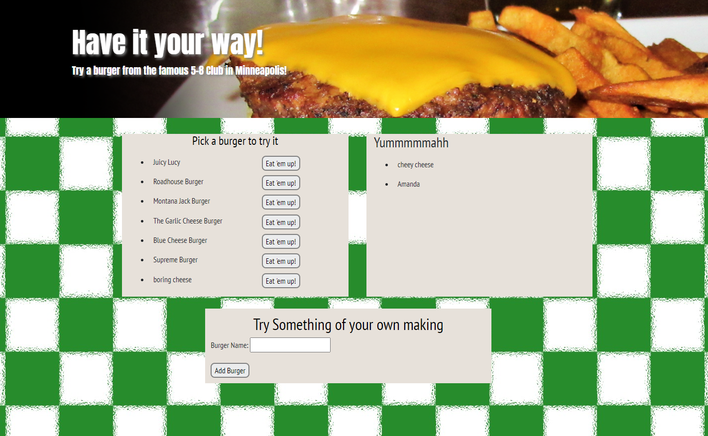

# Have it your way

## Description
A fun app that lets you customize and eat burgers and track what you have eaten.

## Deployed Site
[Thoughts on Thoughts](https://have-it-your-way.herokuapp.com/)

## Table of Contents
  
| [Installation](#installation) |
| [Use](#use) |
| [Contributors](#contributors) |
| [Test Instructions](#test-instructions) |
| [License Information](#license-information) |
    
## Installation
The packages required to run this program are: mysql, expres, express-handlebars
  
## Use
Utilizes express and handlebars 
  
## Contributors
- [Lindsey Bordner](https://github.com/LindseyM20)
- [Brooklynne Audette](https://github.com/B-Audette)
- [Dortea Flores-Kestner](https://github.com/dfkestner)
  
## Test Instructions
none
  
## License Information
n/a